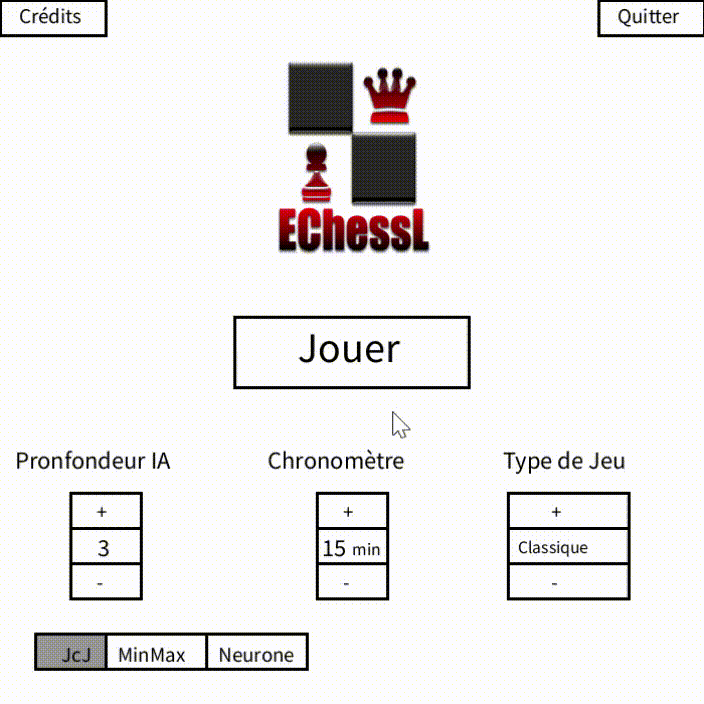
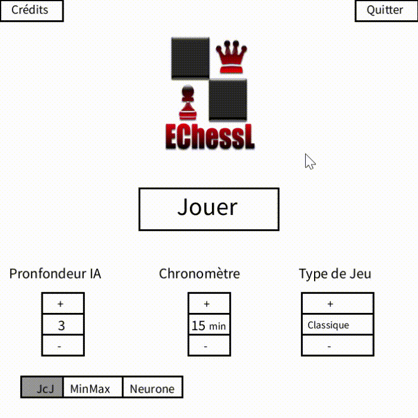

      

# 👋 Introducing `EChessL`

    

`EChessL` is a collaborative project on creating a chess game to play with your friend, or against an AI in case your don't have one at hand !

# 🚀 Demo
Here is a quick demo of the app. We hope you enjoy it.

    
    

# 💻 Use `EChessL`
Please access `EChessL` as follow :
- download Processing
- clone the repository and launch the app with `EchessL.pde`

# 🔥 Features
`EChessL` comes with a bundle of features already. You can do the followings with it,

<!---     
    Project name, logo (if any).
    An introduction to the project (if possible with an image)
    How to run the project locally. Provide all the steps after you've tested it out.
    Demo link (if any)
    What kind of features does the project support? Provide a list of them.
    If possible, list down the upcoming features at a high level.
    Describe the technologies used in the project.
    Provide deployment information. Here you have an opportunity to add deploy buttons to deploy your project on services like Vercel, Netlify, and more.
    Provide stats about the repository. You can use shields to create intuitive buttons to show the stars, forks, licenses, and many other details.
    Provide clear information on how to contribute to your project.
    Thank all the Stargazers (people who have starred your repo).
    Feel free to use emojis in your readme file, but don't overdo it.
--->
